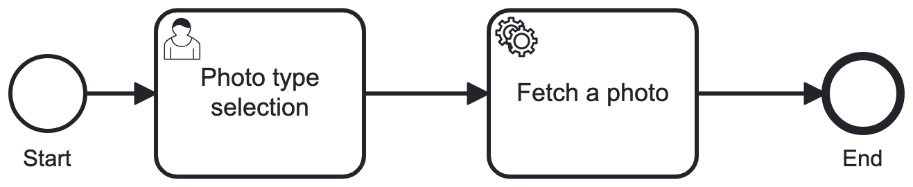
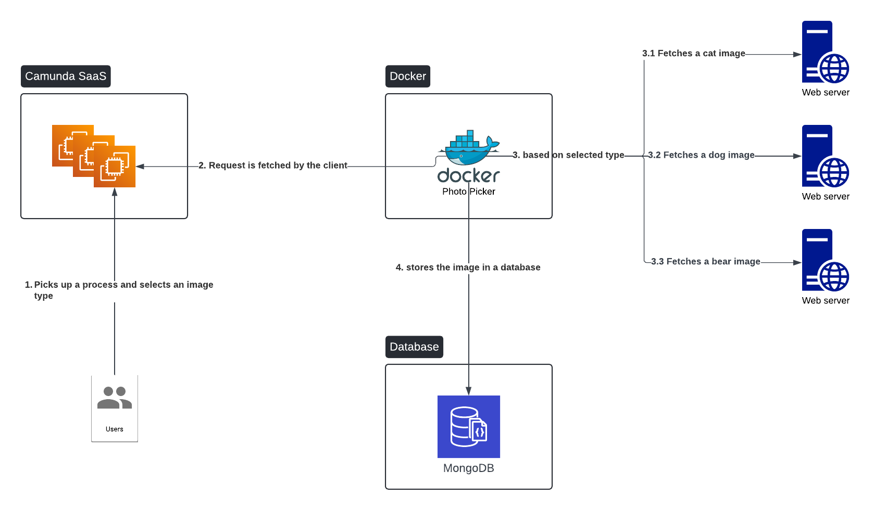
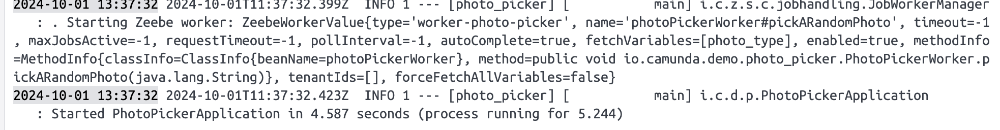
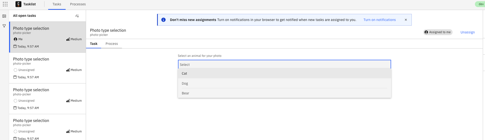
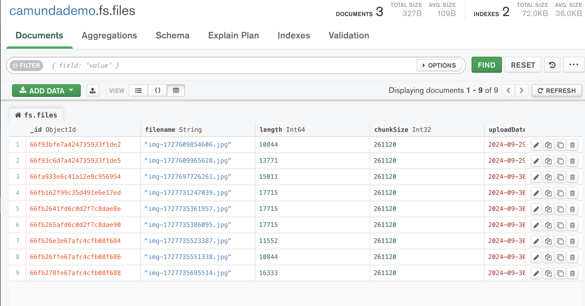

# Camunda client - Photo Picker

## Description
This is a camunda 8 service client to fetch a photo from online resources based on user's selection.
## Camunda Model

## Architecture diagram

## Requirements
- Camunda 8 environment
- Internet connection and access to the followings
  - Camunda cloud
  - https://placekitten.com
  - https://place.dog
  - https://placebear.com
- Docker environment
- Photo picker process application to be imported into your Camunda environment (please see: ./photo-picker.bpmn)
- MongoDB
- Maven

## How to run locally?
Please follow the steps below to run this application locally

1. Import the bpm process into your Camunda 8 environment
2. Clone this repository
3. Configure /src/main/resources/application.properties file
   - Configure your camunda 8 cloud details
   - Configure your mongodb details
4. Install maven application by running: `mvn clean install`
   - This will create target folder and export the application as jar
5. Open a terminal and navigate to the root folder of the project
6. Build a docker image by running `docker build -t photo_picker .`
7. Verify that the image is created by running `docker images`
8. Start a docker container by running `docker run -p 8000:8080 photo_picker`
9. Verify that the container has started successfully by checking the logs, you should see something similar to below

## How to verify?
To verify that everything is working, you can simply run the imported bpm process in camunda

1. Go to your Camunda modeler
2. Find the photo-picker process and run it
3. Navigate to the Tasklist
4. Select a type of photo to fetch randomly

5. Verify that a new database entry is created in your MongoDB
   